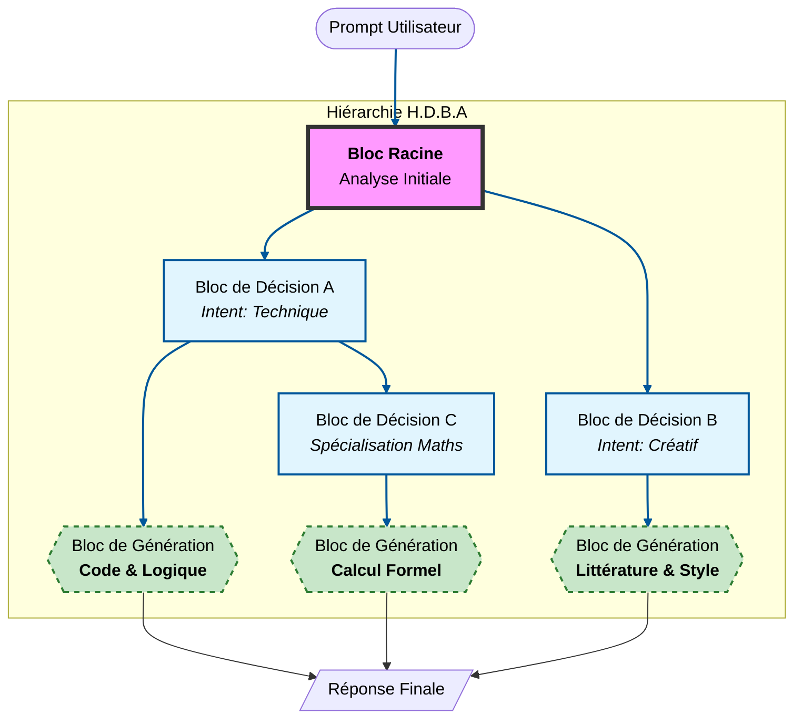

 
# H.D.B.A. (Hierarchical Divisible Block Architecture)

> Concept exploratoire pour une architecture de modèles de langage modulaires, hiérarchiques et adaptatifs.

---

## Concept

H.D.B.A propose une approche alternative aux modèles de langage monolithiques.  
Plutôt que d’utiliser un seul réseau massif, l’idée est de **fragmenter le modèle en blocs spécialisés**, organisés en **arborescence hiérarchique**, avec un **routage dynamique** basé sur le contexte et la complexité de la tâche.  

Cette architecture vise à :  
- Réduire la consommation mémoire lors de l’inférence.  
- Permettre une extensibilité modulaire.  
- Optimiser la vitesse et l’efficacité énergétique grâce au **chargement sélectif de blocs**.  

---

## Structure Topologique

- **Blocs de Décision (couches supérieures)**
  - Rôle : Analyse sémantique, classification d’intention, affinage du prompt.  
  - Taille : Légère, optimisée pour le routage.  
  - Sortie : Vecteur de direction (choix du bloc suivant) + prompt enrichi.

- **Blocs de Génération (terminaux)**
  - Rôle : Production textuelle finale et maîtrise du langage.  
  - Taille : Massifs, haute densité de paramètres.  
  - Particularité : Peuvent apparaître à n’importe quel niveau si aucune spécialisation supplémentaire n’est nécessaire.

---

## Flux d’Inférence (Conceptuel)

1. Le prompt entre dans le **Bloc Racine**.  
2. Chaque bloc de décision **oriente le flux** vers la sous-branche la plus adaptée.  
3. Le prompt est **affiné à chaque étape** pour inclure des instructions contextuelles internes.  
4. L’inférence **s’arrête** dès qu’un bloc de génération terminal est atteint.  
5. Seul le bloc terminal produit les tokens finaux.

> Le flux est **séquentiel et sélectif**, contrairement aux modèles classiques où tous les poids sont activés pour chaque requête.

---

## Gestion des Ressources

- **Empreinte disque** : Très importante (la somme de tous les blocs spécialisés peut atteindre plusieurs téraoctets).  
- **Empreinte RAM** : Optimisée, seul le chemin actif est chargé en mémoire vive.  
- **Performance** : Dépend de la vitesse de lecture du stockage. Possibilité de **préchargement / buffering** des blocs pour maximiser le débit de tokens.

---

## Schéma 

---
## Avantages Conceptuels

- **Économie à l’inférence** : Très faible consommation énergétique comparée à un modèle monolithique.  
- **Modularité et extensibilité** : Les blocs peuvent être remplacés ou ajoutés sans réentraîner l’ensemble.  
- **Adaptabilité** : Les chemins s’adaptent à la complexité de la tâche.  
- **Pipeline optimisé** : Possibilité de buffering pour augmenter le débit de tokens/s.

---

## Remarques

- H.D.B.A est une **idée exploratoire**, non un projet opérationnel.  
- L’entraînement serait coûteux (CAPEX élevé) mais l’utilisation pourrait rester très efficace.  
- Cette architecture ouvre la voie à des modèles de langage **évolutifs, spécialisés et économes en ressources**.

---

## Licence

Ce contenu est publié sous la licence [CC BY 4.0](https://creativecommons.org/licenses/by/4.0/).  
Auteur : Salengros Liam.  
Vous êtes libre de copier, modifier et partager ce contenu, à condition de m’attribuer correctement.

---

*Ce README a pour objectif de présenter H.D.B.A comme concept et inspiration pour la recherche et l’innovation en IA, sans prétendre à une implémentation immédiate.*

*Conçu et imaginé par Salengros Liam — 2026*

*Rédaction technique assistée par intelligence artificielle*
